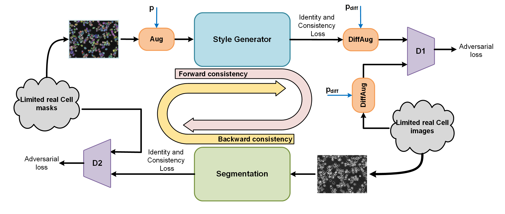

# GANSeg 

This repo contains the training and evaluation code for the project "Enhancing Cell Segmentation with Limited Annotated Data: A Customized CycleGAN Approach". 

Here, we leverage the potential of a version of GAN, termed CycleGAN, to introduce a solution to train cell segmentation models with limited annotated cell images, effectively addressing the challenge of insufficient annotated data in microscopy imaging. We achieved this enhancement by implementing a customized CycleGAN architecture. These components interact synergistically to amplify the quality and diversity of the synthetic cell images. This approach not only increases the variability seen during training but also enhances the authenticity of synthetic samples, thereby strengthening the overall predictive accuracy and robustness of the cell segmentation model.

### Datasets

* Link to [Stem cell dataset example](https://drive.google.com/drive/folders/1M5UDPfjSrdWdCieGubpDiM31pHMclhaD?usp=sharing)

* Link to [Bronchial epithelial cell dataset example](https://drive.google.com/drive/folders/1NPK6VoyoUs77Uvx1fH091RwYrH8VgF4p?usp=sharing)

### Requirements

* [Optional] Create a conda or python virtual environment.

* Install required packages using the `requirements.txt` file.
```
pip install -r requirements.txt
```

### Usage
* #### Run CycleGAn-based model training
Run train.py with the train set of segmentation dataset (the same format of dataset examples above)
```
Example:
python train.py --train_set_dir  segmentation_dataset/train/  --lr 0.0001 --p_vanilla 0.5 --p_diff 0.2 --output_dir tmp/
```

* #### Run the segmentation model test
Run test_segmentation_model.py with the test set of segmentation dataset and the segmentation checkpoint
```
Example:
python test_segmentation_model.py --test_set_dir segmentation_dataset/test/ --ckpt_dir trained_models/Seg.pth --output_dir tmp/
```
* #### Run the generator model test
Run test_generator_model.py with the test set of segmentation dataset and the generator checkpoints
```
Example:
python test_generator_model.py --test_set_dir segmentation_dataset/test --gen_ckpt_dir trained_models/Gen.pth --style_ckpt_dir trained_models/StyleNet.pth --output_dir tmp/
```

### Useful Information
If you have any questions, contact us at abzargar@ucsc.edu.

